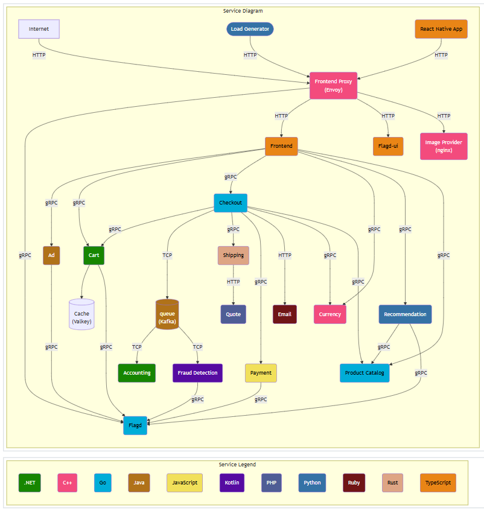

# 🚀 EcomTelemetry - OpenTelemetry E-Commerce Application

## 📝 Project Overview

EcomTelemetry is an open-source, microservices-based **e-commerce** application, inspired by the **OpenTelemetry Demo** project. It demonstrates **observability**, **scalability**, and **automation** best practices for deploying and managing modern cloud-native applications on AWS using Kubernetes.

This project showcases a complete **CI/CD workflow**, **infrastructure provisioning**, and **GitOps** deployment strategies—making it a comprehensive example for **DevOps engineers** and **cloud practitioners**.

## 🏗️ Project Architecture

A high-level **Project Architecture Diagram** provides an overview of system design and component interactions.

📌 **Project Architecture Diagram:**  

## 🛠️ Tech Stack

| Category                 | Tools & Technologies    |
|--------------------------|------------------------ |
| ☁️ Cloud Provider        | AWS                     |
| 🚢 Orchestration         | Kubernetes (EKS)        |
| ⚙️ IaC                   | Terraform               |
| 🔄 CI/CD                 | GitHub Actions, Argo CD |
| 🐳 Containers            | Docker                  |
| 🌐 DNS/Domain            | AWS Route 53            |
| 📦 Artifact Registry     | DockerHub               |
| 🔒 Security Scanning     | Trivy                   |
| 📝 Code Quality          | GolangCI-Lint           |

## ✨ Key Features

✅ Microservices architecture deployed on **Kubernetes (EKS)**.  
✅ **Infrastructure as Code (IaC)** with **Terraform** for AWS provisioning.  
✅ Automated **CI/CD pipelines** via **GitHub Actions** and **Argo CD (GitOps)**.  
✅ **Custom domain mapping** with AWS Route 53: www.devopsbypritam.info.  
✅ **End-to-End automation** from code commit to deployment.

## ☁️ Infrastructure Setup Using Terraform

The complete infrastructure setup for this project has been implemented using the following GitHub repository:

🔗 [Terraform AWS EKS Repository](https://github.com/Preetbandgar/EcomTelemetry-App.git)

- Terraform modules are used to provision:
  - **EKS Cluster**
  - **VPC**
  - **IAM Roles**
  - **Route 53 Custom Domain Configuration**
  - **S3 + DynamoDB (Terraform Backend State Management)**

## 🔄 CI/CD Pipeline and GitOps Implementation

Implemented an automated **CI/CD pipeline** using **GitHub Actions** and **Argo CD**, specifically managing the deployment of the `productcatalog` microservice.

### ⚙️ CI/CD Workflow Stages:

| Stage                      | Description                                              |
|----------------------------|----------------------------------------------------------|
| **Build**                  | Compiles the application code.                          |
| **Code-Quality**           | Runs code quality checks using **golangci-lint**.        |
| **Go-Code-Check**          | Performs Go code analysis for best practices.            |
| **Docker**                 | Builds the Docker image of the microservice.             |
| **Trivy-Docker-Image-Scan**| Scans Docker images for vulnerabilities using **Trivy**. |
| **UpdateK8s**              | Updates the Kubernetes manifest files with the new image tag. |
| **Argo CD Sync**           | Argo CD automatically detects changes, syncs, and triggers a **rolling update** of the microservice deployment. |

📌 **CI/CD Pipeline Screenshots:**  
- [GitHub Actions Workflow Run](./assets/screenshots/github-actions-workflow.png)  
- [GolangCI-Lint Code Quality Check](./assets/screenshots/code-quality-check.png)  
- [Docker Image Build & Push](./assets/screenshots/docker-image-push.png)  
- [Trivy Image Scan Results](./assets/screenshots/trivy-docker-scan.png)  
- [Kubernetes Manifest Update](./assets/screenshots/update-k8s.png)  
- [Argo CD Sync Operation](./assets/screenshots/argo-cd-sync.png)  
- [Rolling Update in Progress](./assets/screenshots/rolling-update.png)

## 🚀 Deployment Details

The application is accessed via the **frontendproxy service**, mapped to a **custom domain** using **AWS Route 53**:  
🌐 **www.devopsbypritam.info**

### 🔧 Domain & DNS Configuration:  
- Domain mapping and DNS setup have been thoroughly documented with screenshots and a dedicated demo video.

📹 **[Video: Custom Domain Mapping Demo](./assets/custom-domain-demo.mp4)**

📌 **Route 53 & DNS Configuration Screenshots:**  
- [Route 53 Hosted Zone Setup](./assets/screenshots/route53-hosted-zone.png)  
- [DNS Records for Domain Mapping](./assets/screenshots/dns-records.png)  
- [FrontendProxy Service Exposure](./assets/screenshots/frontendproxy-service.png)

Deployment was carried out using the **`complete-deploy.yaml`**, containing manifests for all **microservices** and **Kubernetes components**.

## 🌟 Project Highlights

✅ Designed and deployed a **highly available microservices-based application** on AWS EKS  
✅ Developed **infrastructure automation** using Terraform  
✅ Implemented **GitOps** workflows with Argo CD for automated deployments  
✅ Automated CI/CD pipelines with GitHub Actions, including Docker image build, push, Trivy scans and Argo CD sync  
✅ Configured **custom domain and DNS routing** using AWS Route 53: **www.devopsbypritam.info**  

## 📸 Screenshots & Demo Videos

Screenshots and video assets are available in the `/assets` folder:  
🖼️ **Infrastructure Setup**  
🖼️ **CI/CD Pipelines**  
🖼️ **DNS/Route 53 Configuration**  
📹 **Video Walkthroughs** (including custom domain mapping)

## 💡 Open Source Acknowledgement

This project is **inspired by OpenTelemetry**, and full credit goes to the **OpenTelemetry team** and **Abhishek Veermalla**.  
Abhishek worked hard to create the necessary files for this project, explained them in detail, and demonstrated their usage.  
Please check out his GitHub profile for more insightful content and projects:  
👉 **[Abhishek Veermalla's GitHub](https://github.com/iam-veeramalla)**

## 🙏 Thank You :)
