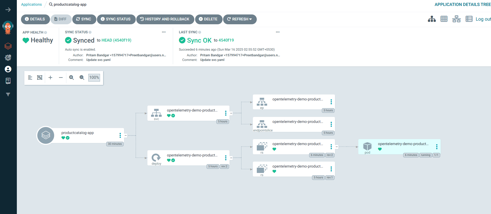

# 🚀 EcomTelemetry - OpenTelemetry E-Commerce Application

## 📝 Project Overview

EcomTelemetry is an open-source, microservices-based **e-commerce** application inspired by the **OpenTelemetry Demo** project. It demonstrates **scalability**, and **automation** best practices for deploying and managing modern cloud-native applications on AWS using Kubernetes.

This project demonstrates end-to-end **CI/CD automation**, **infrastructure provisioning**, and **GitOps deployment**, aligning with best practices in modern **DevOps and cloud-native application management**.

## 🏗️ Project Architecture

A high-level architecture diagram highlights the system design and component interactions.

📌 **Architecture Diagram:**  

## 🛠️ Tech Stack

| Category            | Tools & Technologies                  |
|---------------------|--------------------------------------|
| ☁️ Cloud Provider    | AWS                                  |
| 🚢 Orchestration     | Kubernetes (EKS)                     |
| ⚙️ Infrastructure    | Terraform                            |
| 🔄 CI/CD            | GitHub Actions, Argo CD              |
| 🐳 Containers        | Docker                               |
| 🌐 DNS/Domain        | AWS Route 53                         |
| 📦 Artifact Registry | DockerHub                            |
| 🔒 Image Scanning    | Trivy                                |
| 📝 Code Quality      | GolangCI-Lint, SonarQube             |

## ✨ Key Features

- Microservices architecture deployed on **AWS EKS**
- **Infrastructure as Code (IaC)** with **Terraform**
- Automated **CI/CD pipelines** using **GitHub Actions** and **Argo CD (GitOps)**
- **Custom domain** routing via **AWS Route 53**  
  🌐 [www.devopswithpritam.info](https://www.devopswithpritam.info)(./assets/screenshots/Otel_demo_custom-domain.png)
- End-to-end **automation** from code commit to deployment

## ☁️ Infrastructure Setup with Terraform

The entire infrastructure was provisioned using Terraform, available in the GitHub repository:  
🔗 [Terraform AWS EKS Repository](https://github.com/Preetbandgar/Terraform-aws-eks.git)

Resources provisioned include:

- **EKS Cluster**
- **VPC**
- **IAM Roles**
- **Route 53 Custom Domain Configuration**
- **S3 + DynamoDB for Terraform Backend and state locking**

## 🔄 CI/CD Pipeline and GitOps

An automated **CI/CD pipeline** was implemented with **GitHub Actions** and **Argo CD**, managing the deployment of the [`productcatalog`](https://github.com/Preetbandgar/EcomTelemetry-App/tree/main/kubernetes/productcatalog) microservice.

### ⚙️ CI/CD Workflow Stages

| Stage                   | Description                                                    |
|-------------------------|----------------------------------------------------------------|
| **Build**               | Compiles application code                                      |
| **Code Quality**        | Runs static code analysis with **SonarQube**                  |
| **Go Code Check**       | Enforces coding standards with **GolangCI-Lint**              |
| **Docker Build & Push** | Builds and pushes Docker images to **DockerHub**              |
| **Image Scan**          | Scans Docker images for vulnerabilities using **Trivy**       |
| **K8s Manifest Update** | Updates Kubernetes manifests with the new image tag           |
| **Argo CD Sync**        | Syncs with **Argo CD** and triggers rolling updates automatically |

📌 **CI/CD Workflow Links & Screenshots**  

- [GitHub Actions Workflow Run](https://github.com/Preetbandgar/EcomTelemetry-App/actions/runs/13877069831)  
- [SonarQube Code Quality Check](./assets/screenshots/Sonarqube_Code_Quality.png)  
- [GolangCI-Lint Code Analysis](https://github.com/Preetbandgar/EcomTelemetry-App/actions/runs/13877069831/job/38830720174)  
- [Docker Image Build & Push](https://github.com/Preetbandgar/EcomTelemetry-App/actions/runs/13877069831/job/38830720176)  
- [Trivy Image Scan Results](https://github.com/Preetbandgar/EcomTelemetry-App/actions/runs/13877069831/job/38830729444)  
- [Kubernetes Manifest Update](https://github.com/Preetbandgar/EcomTelemetry-App/actions/runs/13877069831/job/38830732368)

### 📌 Argo CD Sync & Deployment Validation

- **Argo CD Sync Operation**

  

- **Post-Sync Validation: Application Healthy and Running**

  

The application was exposed via the **frontendproxy service**, mapped to the custom domain:  

🌠(./assets/screenshots/Otel_demo_custom-domain.png)

🌐 [www.devopswithpritam.info](https://www.devopswithpritam.info)(./assets/screenshots/Otel_demo_custom-domain.png)

> ✅ Note: The application was successfully deployed and accessible during the demonstration phase. The screenshots provided illustrate the complete deployment lifecycle.

## 🔧 Domain & DNS Configuration

📌 **Route 53 & DNS Setup Screenshots**  
- DNS Records for Domain Mapping

  

- FrontendProxy Service Exposure 

  

The deployment was managed through [`complete-deploy.yaml`](./kubernetes/complete-deploy.yaml), containing manifests for all microservices and Kubernetes components.

## 🌟 Project Highlights

- Deployed a highly available microservices application on **AWS EKS**
- Developed **Infrastructure as Code (IaC)** with Terraform for **scalable, repeatable** infrastructure provisioning
- Automated **CI/CD pipelines** with GitHub Actions and Argo CD for **seamless deployments**
- Ensured code quality and security with **SonarQube**, **GolangCI-Lint**, and **Trivy**
- Implemented **custom domain routing** with AWS Route 53  
  🌐 [www.devopswithpritam.info](https://www.devopswithpritam.info)
- Future scope includes **OpenTelemetry observability integration** and **Prometheus/Grafana** monitoring enhancements

## 💡 Open Source Acknowledgement

This project draws inspiration from **OpenTelemetry**. Full credit to the **OpenTelemetry team** and **Mr. Abhishek Veermalla**, whose guidance and resources were instrumental.  
Check out his GitHub for more insightful content:  
👉 [Abhishek's GitHub](https://github.com/iam-veeramalla)

## 🙏 Thank You!
